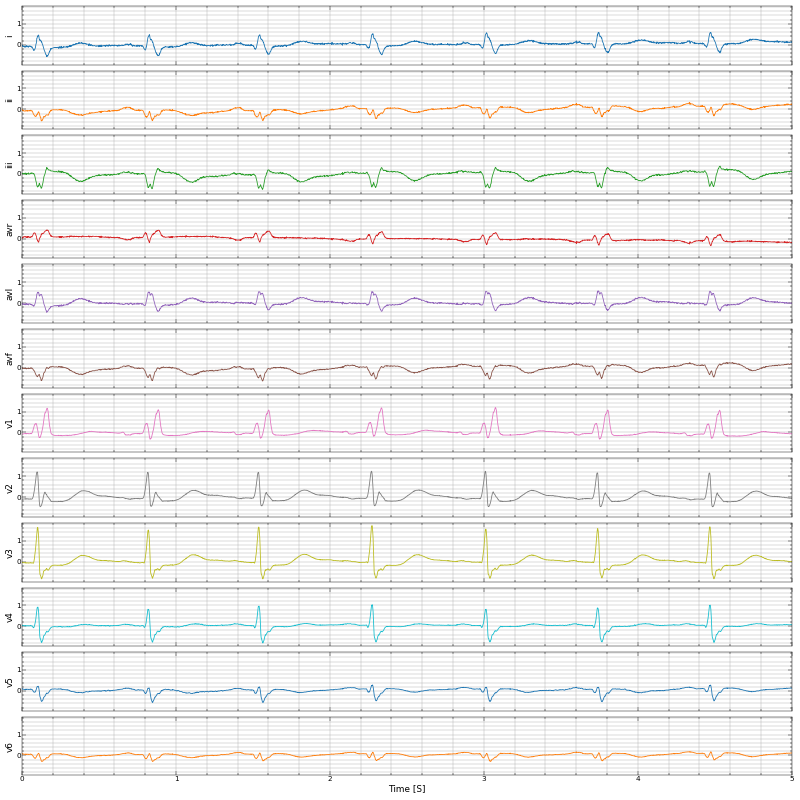
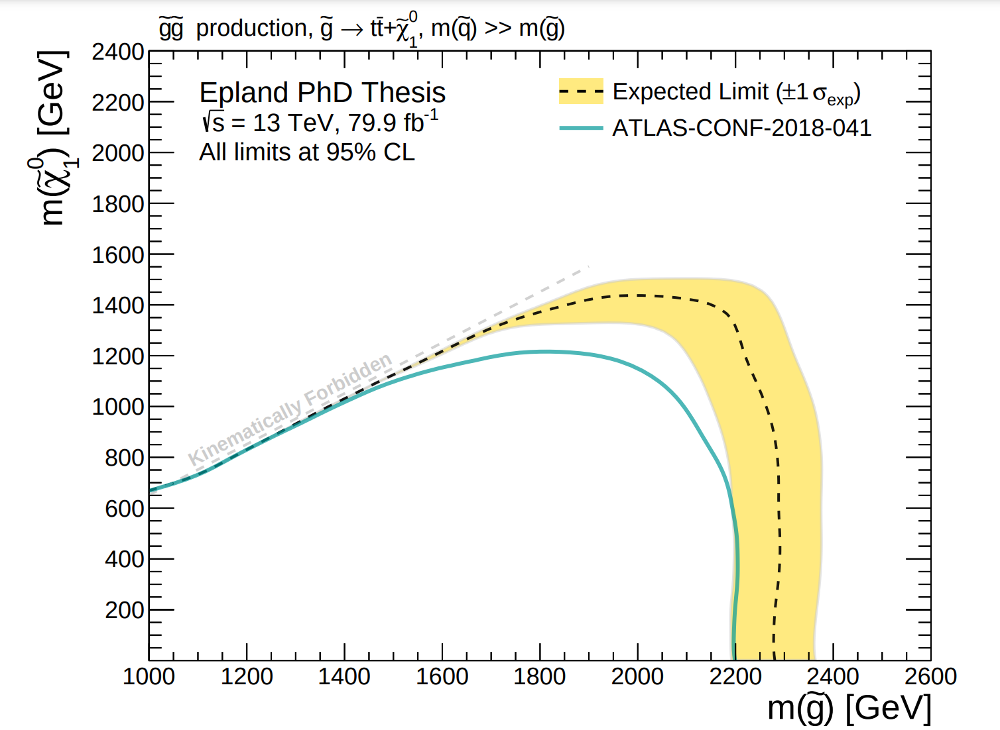
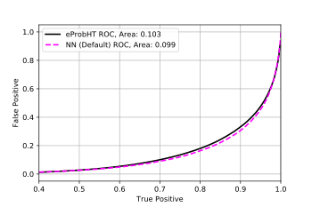
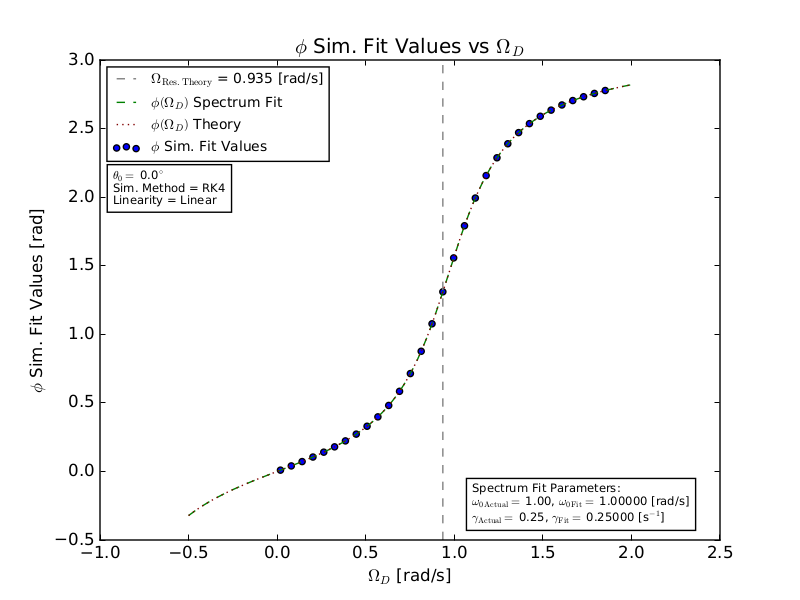

# About

I am a freelance Data Scientist working with top 25 pharmaceutical companies to improve patient journeys.
In my spare time I contribute to the
<a href="https://github.com/csinva/imodels" target="_blank" rel="noopener noreferrer">`imodels`</a>
and
<a href="https://github.com/parrt/dtreeviz" target="_blank" rel="noopener noreferrer">`dtreeviz`</a>
python libraries.
I enjoy investigating anomalous data and building new models!

# Projects

<!-- ## Lake Hunt
<i class="fa fa-github-square" aria-hidden="true"></i> <a href="https://github.com/mepland/lake_hunt" target="_blank" rel="noopener noreferrer">Repository</a>

**Description:**
WIP

**Methods:**
Google Maps API

**Software:**
`python 3.11`
-->

## Chance of Showers

<nobr>
<i class="fa fa-github-square" aria-hidden="true"></i> <a href="https://github.com/mepland/chance_of_showers" target="_blank" rel="noopener noreferrer">Repository</a>
</nobr>

 

**Description:**
This project provides live water pressure measurements via a web dashboard running on a Raspberry Pi,
logs the data, and creates time series forecasts of future water pressure,
all to lower the odds of being stranded halfway through a shower with unreliable water pressure!
Work in progress.

**Methods:**
Time Series Analysis,
Predictive Modeling,
Hyperparameter Optimization,
Bayesian Optimization,
Data Acquisition (DAQ),
Cron Job "Heartbeat" Monitoring,
Web Dashboard,
Python Linting

**Software:**
`python 3.11`,
`darts`,
`torch`,
`prophet`,
`plotly`,
`polars`,
`flask`

 

## ACIC Causality Challenge 2022
Inverse Probability Weighting Difference-in-Differences (IPWDID)

<!--

-->

<nobr>
<i class="fa fa-github-square" aria-hidden="true"></i> <a href="https://github.com/mepland/acic_causality_challenge_2022" target="_blank" rel="noopener noreferrer">Repository</a>
</nobr>
<i class="fa fa-file-text-o" aria-hidden="true"></i> <a href="https://doi.org/10.1353/obs.2023.0027" target="_blank" rel="noopener noreferrer">Paper</a>
 
<i class="fa fa-file-text-o" aria-hidden="true"></i> <a href="https://docs.google.com/presentation/d/1IzwBvmbTapf6lReX_EWvhtPTmiuobDrBx7z89cKOvhI" target="_blank" rel="noopener noreferrer">Slides</a>
 
<i class="fa fa-external-link-square" aria-hidden="true"></i> <a href="https://acic2022.mathematica.org" target="_blank" rel="noopener noreferrer">Challenge Site</a>

**Description:**
In this American Causal Inference Conference (ACIC) 2022 challenge submission,
the canonical difference-in-differences (DID) estimator
has been used with inverse probability weighting (IPW)
and strong simplifying assumptions
to produce a benchmark model of the
sample average treatment effect on the treated (SATT).
Despite the restrictive assumptions and simple model,
satisfactory performance in both point estimate and confidence intervals was observed,
ranking in the top half of the competition.

**Methods:**
Causal Inference,
Inverse Probability Weighting (IPW),
Difference-in-Differences (DID),
Generalized Linear Models (GLM),
Bootstrapping,
Monte Carlo,
One Hot Encoding

**Software:**
`R`,
`speedglm`,
`boot`,
`python 3.9`,
`pyspark`,
Snowflake

 

## Mount Sinai Health Hackathon EKG Imaging Project

<nobr>
<i class="fa fa-github-square" aria-hidden="true"></i> <a href="https://github.com/mepland/mount_sinai_health_hackathon_ekg_img" target="_blank" rel="noopener noreferrer">Repository</a>
</nobr>
<i class="fa fa-file-text-o" aria-hidden="true"></i> <a href="https://doi.org/10.1016/j.cpcardiol.2023.101744" target="_blank" rel="noopener noreferrer">Paper</a>
 
<i class="fa fa-external-link-square" aria-hidden="true"></i> <a href="https://doi.org/10.5281/zenodo.7972397" target="_blank" rel="noopener noreferrer">Paper Data</a>

**Description:**
Electrocardiograms (EKG) play a pivotal role in modern medicine,
but are commonly interpreted with proprietary and machine specific algorithms.
We developed an image recognition model which can be used
to read standard EKG strip printouts across machines.
An austere variation of the MobileNetV3 convolutional neural network (CNN) model
was trained on publicly available labeled waveform data
to classify 12-lead EKGs between seven clinically important diagnostic classes.

**Methods:**
Convolutional Neural Network (CNN),
Image Classification,
Multi-class Classification

**Software:**
`python 2.7`,
`torch`,
`matplotlib`

## A Search for Supersymmetry in Multi-b Jet Events with the ATLAS Detector

<nobr>
<i class="fa fa-file-text-o" aria-hidden="true"></i> <a href="assets/projects/dissertation/defense_public-epland.pdf" target="_blank" rel="noopener noreferrer">Defense Slides</a>
</nobr>
<i class="fa fa-file-text-o" aria-hidden="true"></i> <a href="assets/projects/dissertation/dissertation-epland.pdf" target="_blank" rel="noopener noreferrer">Dissertation (PDF)</a>
 
<i class="fa fa-external-link-square" aria-hidden="true"></i> <a href="https://hdl.handle.net/10161/18738" target="_blank" rel="noopener noreferrer">Dissertation (Online)</a>
<!---
Also available at https://cdsweb.cern.ch/record/2632347
-->

**Description:**
Ph.D. dissertation searching for supersymmetry (SUSY) in pair-produced gluinos
at the large hadron collider's (LHC) ATLAS experiment.
The search employed a parameterized boosted decision tree (BDT) to separate SUSY signal events from standard model backgrounds.
New methods for optimal BDT parameter point selection and signal region creation
were used to increase the search's sensitive area by ∼30%.

**Methods:**
Boosted Decision Tree (BDT),
Hypothesis Testing,
Statistical Significance,
Hyperparameter Optimization,
Bayesian Optimization,
Feature Importance,
Feature Selection,
Network Analysis,
Monte Carlo

**Software:**
`python 2.7`,
`xgboost`,
`scikit-optimize`,
`networkx`,
`ROOT`

## Exploring Interdisciplinary Research at Duke via Ph.D. Committees
1st Place - 2018 Scholars@Duke Visualization Challenge

<nobr>
<i class="fa fa-github-square" aria-hidden="true"></i> <a href="https://github.com/mepland/vis_challenge_2018" target="_blank" rel="noopener noreferrer">Repository</a>
</nobr>
<i class="fa fa-file-text-o" aria-hidden="true"></i> <a href="assets/projects/vis_challenge_2018/vis_challenge_2018_poster-matthew_epland.pdf" target="_blank" rel="noopener noreferrer">Poster</a>
 
<i class="fa fa-file-text-o" aria-hidden="true"></i> <a href="assets/projects/vis_challenge_2018/vis_challenge_2018_paper-matthew_epland.pdf" target="_blank" rel="noopener noreferrer">Paper</a>
 
<i class="fa fa-area-chart" aria-hidden="true"></i> <a href="https://blocks.roadtolarissa.com/mepland/raw/598590f30f49b17dc76ea4ed74695252" target="_blank" rel="noopener noreferrer">Interactive Network</a>
 
<i class="fa fa-external-link-square" aria-hidden="true"></i> <a href="https://researchblog.duke.edu/2018/02/06/duke-scholars-bridge-disciplines-to-tackle-big-questions" target="_blank" rel="noopener noreferrer">Duke Scholars Bridge Disciplines to Tackle Big Questions</a>

**Description:**
By combining Duke Ph.D. committee membership data with the faculty appointments directory,
connections between academic organizations were found
and used to construct an undirected, weighted network, i.e. graph.
From this network communities of closely linked organizations were created via the Louvain method.
Additionally, the level of interdisciplinary activity in each organization was measured
by comparing the relative weights of their external and self connections.
Analysis won 1st place in the competition.

**Methods:**
Network Analysis,
Louvain Method

**Software:**
`python 2.7`,
`networkx`,
`pandas`

## ATLAS TRT Particle ID Machine Learning R&D Studies

<nobr>
<i class="fa fa-github-square" aria-hidden="true"></i> <a href="https://github.com/dukeatlas/trtmachana/tree/master/mepland_notebooks" target="_blank" rel="noopener noreferrer">Repository</a>
</nobr>
<i class="fa fa-file-text-o" aria-hidden="true"></i> <a href="assets/projects/trt_ml_pid_project/trt_ml_pid_project.pdf" target="_blank" rel="noopener noreferrer">Slides</a>

**Description:**
R&D studies of particle identification in the ATLAS transition radiation tracker (TRT)
where conducted utilizing machine learning techniques,
with the goal of separating electron tracks from muons.
Developed with fellow Duke graduate students Doug Davis and Sourav Sen,
and continued by Davis and others within the TRT group.
Support vector machines (SVM) and boosted decision trees (BDT)
from the scikit-learn library were tested,
as well as neural networks (NN) constructed with Keras and TensorFlow.

**Methods:**
Support Vector Machines (SVM),
Boosted Decision Trees (BDT),
Neural Networks (NN),
k-fold Cross-Validation

**Software:**
`python 2.7`,
`scikit-learn`,
`keras`,
`tensorflow`

## Numerical Methods and the Dampened, Driven Pendulum

<nobr>
<i class="fa fa-github-square" aria-hidden="true"></i> <a href="https://github.com/mepland/PHYS_566_Computational_HW/tree/main/hw4" target="_blank" rel="noopener noreferrer">Repository</a>
</nobr>
<i class="fa fa-file-text-o" aria-hidden="true"></i> <a href="assets/projects/pendulum/numerical_methods_and_the_dampened_driven_pendulum.pdf" target="_blank" rel="noopener noreferrer">Paper</a>

**Description:**
A computational study of the dampened, driven pendulum using
the Euler-Cromer and Rung-Kutta numerical methods
to investigate resonance, nonlinear behavior, and chaos.
Numerical simulations compared to theory where possible.

**Methods:**
Euler-Cromer,
Rung-Kutta,
Ordinary Differential Equations (ODE),
Chaos and Lyapunov Exponents

**Software:**
`python 2.7`,
`numpy`,
`matplotlib`

# Notes
<nobr>
<i class="fa fa-github-square" aria-hidden="true"></i> <a href="https://github.com/mepland/data_science_notes" target="_blank" rel="noopener noreferrer">Repository</a>
</nobr>

 
TODO

# Publications
TODO


