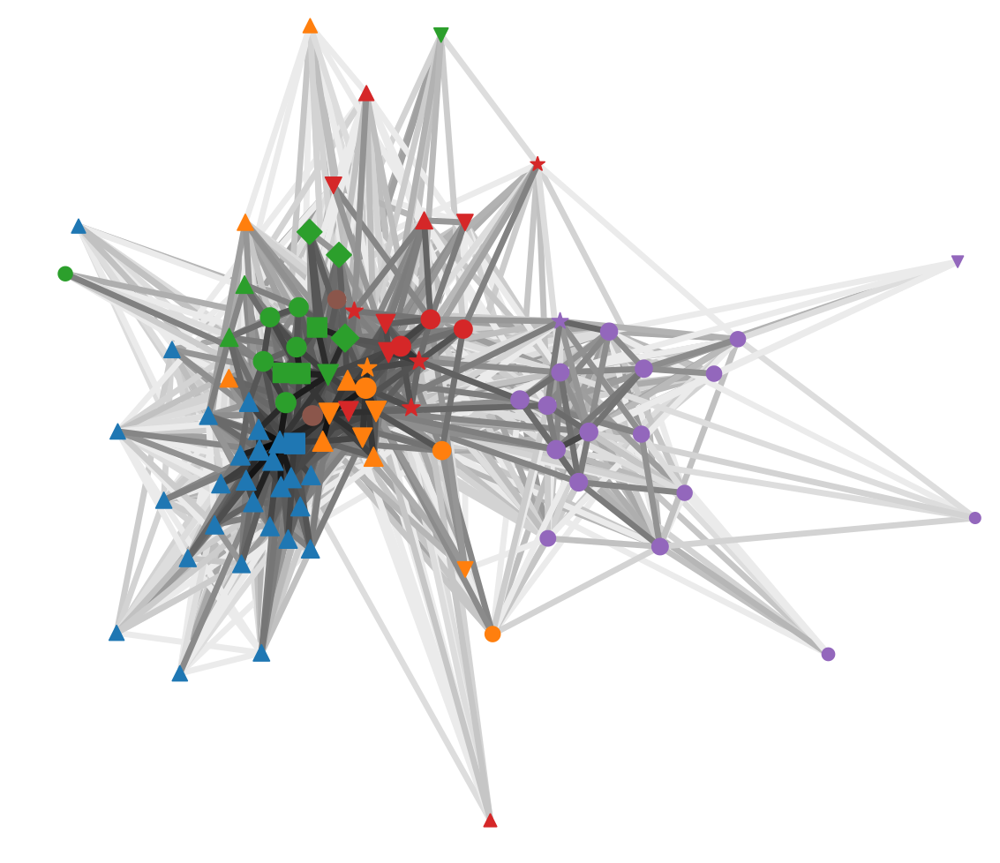

# About

I am a freelance Data Scientist working with top life science companies to improve patient journeys.
In my spare time I contribute to the
<a href="https://github.com/csinva/imodels" target="_blank" rel="noopener noreferrer">`imodels`</a>
and
<a href="https://github.com/parrt/dtreeviz" target="_blank" rel="noopener noreferrer">`dtreeviz`</a>
python libraries.
I enjoy investigating anomalous data and building new models!

# Projects

## Chance of Showers

TODO

## Exploring Interdisciplinary Research at Duke via Ph.D. Committees
1st Place - 2018 Scholars@Duke Visualization Challenge

<i class="fa fa-file-text-o" aria-hidden="true"></i> <a href="assets/projects/vis_challenge_2018/vis_challenge_2018_poster-matthew_epland.pdf" target="_blank" rel="noopener noreferrer">Poster</a>
 
<i class="fa fa-file-text-o" aria-hidden="true"></i> <a href="assets/projects/vis_challenge_2018/vis_challenge_2018_paper-matthew_epland.pdf" target="_blank" rel="noopener noreferrer">Paper</a>
 
<i class="fa fa-area-chart" aria-hidden="true"></i> <a href="https://blocks.roadtolarissa.com/mepland/raw/598590f30f49b17dc76ea4ed74695252" target="_blank" rel="noopener noreferrer">Interactive Network</a>
 
<i class="fa fa-github-square" aria-hidden="true"></i> <a href="https://github.com/mepland/vis_challenge_2018" target="_blank" rel="noopener noreferrer">Repository</a>
 
<i class="fa fa-external-link-square" aria-hidden="true"></i> <a href="https://researchblog.duke.edu/2018/02/06/duke-scholars-bridge-disciplines-to-tackle-big-questions/" target="_blank" rel="noopener noreferrer">Duke Scholars Bridge Disciplines to Tackle Big Questions</a>

**Description:**
By combining Duke Ph.D. committee membership data with the faculty appointments directory,
connections between academic organizations were found
and used to construct an undirected, weighted network (or graph).
From this network communities of closely linked organizations were created via the Louvain method.
Additionally, the level of interdisciplinary activity in each organization was measured
by comparing the relative weights of their external and self connections.
Analysis won 1st place in the competition.

**Methods:**
Network analysis,
Louvain method

**Software:**
`networkx`,
`pandas`


